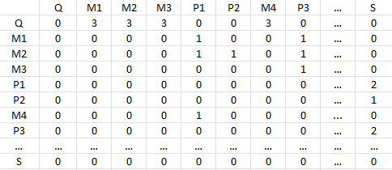
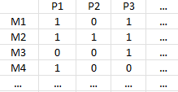

# ProjektAufgaben

- In der Graphschaft Schilda gibt es viel zu tun. Die Graphschaft hat
  viele Mitarbeiter:innen mit unterschiedlichen Kompetenzen (Finanzen,
  Planung, Straßenbau, Festorganisation, und so weiter).
- Viele Projekte sind zu bewältigen, viel mehr, als es Mitarbeitende gibt.
  Gleichzeitig müssen einige Projekte von mehreren Mitarbeitenden
  gemeinsam bearbeitet werden um erfolgreich zu sein.
- Die Graphschaft hat nun, um die Mitarbeitenden vor Überlastung zu
  schützen, die Policy aufgestellt, dass jede Mitarbeiterin und jeder
  Mitarbeiter an maximal 3 Projekten arbeiten darf.
- Damit nun die Kräfte möglichst gut eingesetzt werden, alle
  Mitarbeier:innen entsprechend ihrer Kompetenzen Projekten
  zugeordnet sind,  aber kein Mitarbeiter/keine Mitarbeiterin mehr als 3
  Projekte bearbeitet, bittet die Stadt Schilda Sie ein Planungstool für
  das Matching zwischen Mitarbeiter:innen und Projekten zu erstellen.

  
## Welche Daten sollen verarbeitet werden?

- Mitarbeiter mit Kompetenzen
- Projekte mit Kompetenzbereich 
- Anzahl an benötigten Mitarbeiter pro Projekt 

        All diese Daten werden in einer Adjazenzmatrix gespeichert -> siehe Eingabe 

## Was sind die Eingaben? 
  - Ein Zweidimensionales Array, welches Informationen über die Kompetenzen der Mitarbeiter und der Projekte enthält
    - Beispiel/ Aufbau Matrix:
      
        
  - Erklärung Der Input Matrix: 
 

## Was sind die Ausgaben?

Die Ausgabe ist ein zweidimensionales Array. Jede Zeile entspricht ein Mitarbeiter. Jede Spalte entspricht ein Projekt. 
Falls ein Mitarbeiter einem Projekt zugeordnet ist, so beträgt der Wert in deren Kreuzfeld 1. Wenn ein Mitarbeiter dem jeweiligen Projekt nicht zugeordnet ist, da die benötigten Kompetenzen nicht übereinstimmen, so befindet sich in deren Schnittfeld eine 0.
- Beispiel Output Matrix: 

    

## Welcher Algorithmus eignet sich?

- Für diese Aufgabe eignet sich der Ford Fulkerson Algorithmus, der den maximalen Fluss eines Graphen berechnet. 
- Unsere Klasse Ford Fulkerson gibt einen MaxFlow int - Wert aus, sowei einen Flowgraph und einen Restgraph des Datentyps graph zurück.
- Anhand des Flowgraphen, können dann die einzelnen Zuordnungen ausgelesen werden und in ein geordnetes zweidimensionales Array eingefügt werden. 
## Welche Datenstruktur eignet sich?
- Benutzte Datenstrukturen: 
  - Array
  - List
> Beide Datenstrukturen helfen die Datenstruktur bipartiter Graph (Hier: Zeilen = Mitarbeter; Spalten = Projekte) umzusetzen

## Was ist die Laufzeit?

